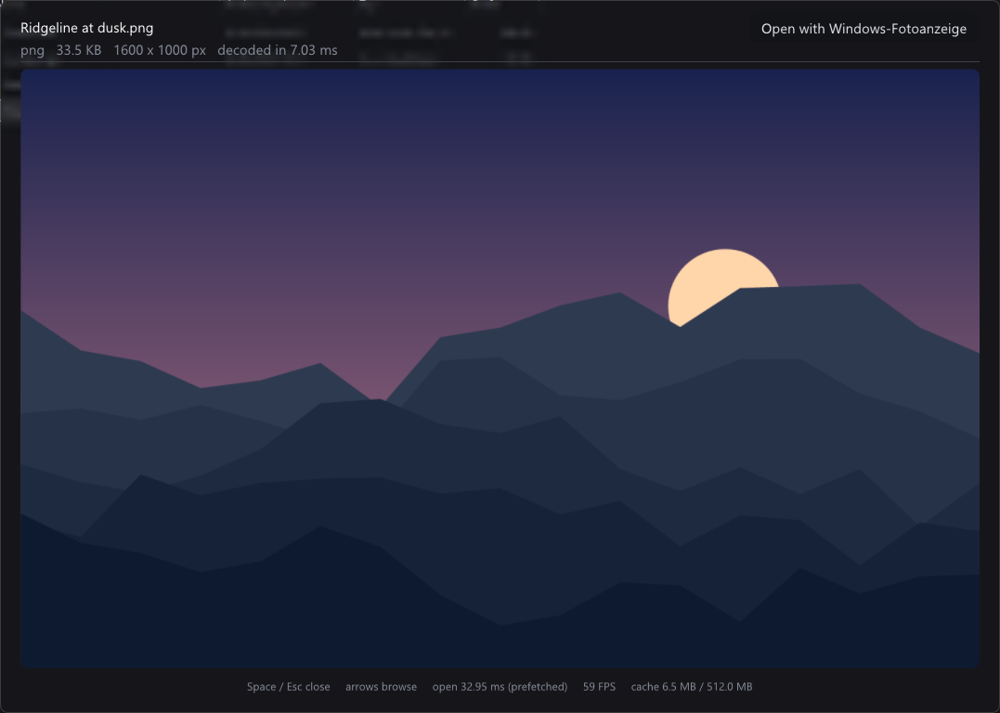
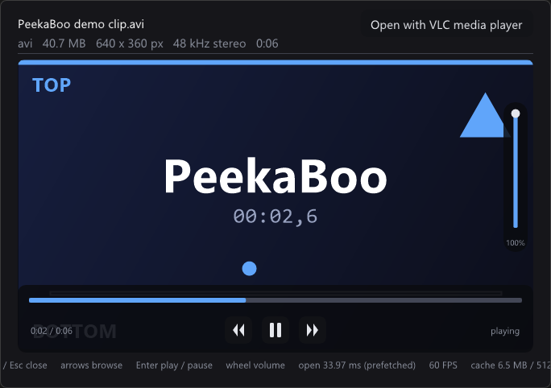
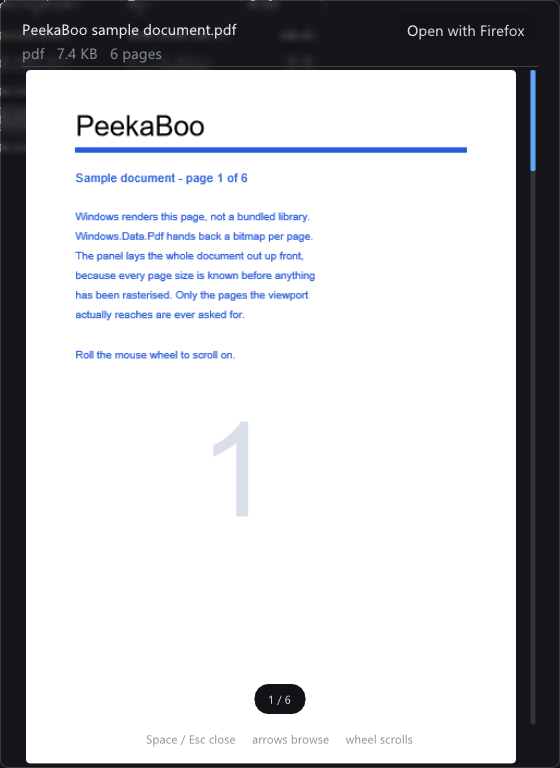
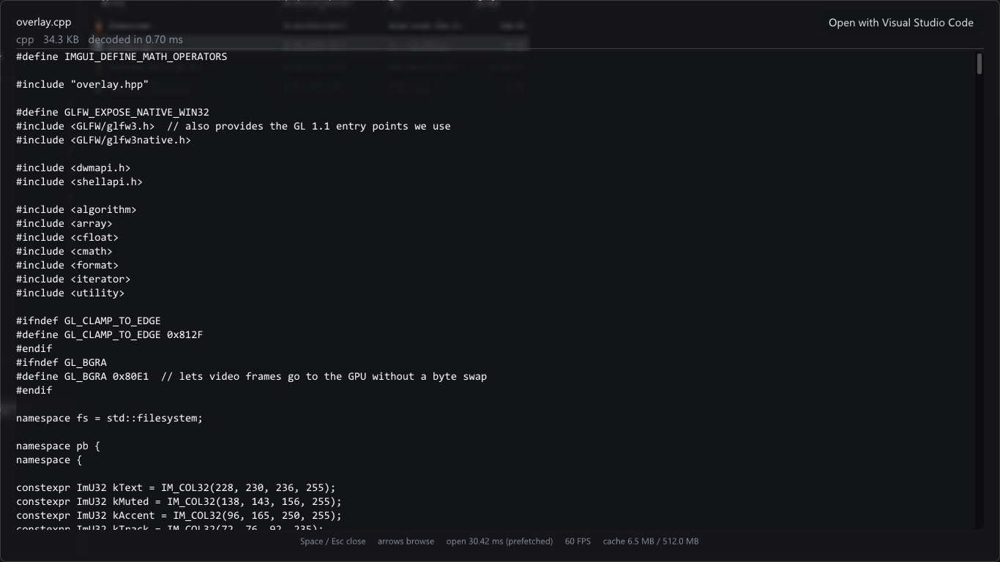

<p align="center">
  
</p>

<h1 align="center">PeekaBoo</h1>

<p align="center">Quick Look for Windows. Select a file, press <b>Space</b>, look at it.</p>

<p align="center">
  <a href="https://github.com/Crankerer/cpp.peekaboo/actions/workflows/build.yml">
    
  </a>
</p>

---

Pick a file in **Windows Explorer** or on the **desktop**, tap **Space**, and the preview panel is
simply there. Tap **Space** or **Esc** to make it go away. Leave it open and walk through the
folder with the **arrow keys**: Explorer moves its selection and the preview follows without a
loading hitch.

PeekaBoo has no window of its own. It sits in the notification area and stays out of the way until
you ask for something.



## Getting started

Run `peekaboo.exe`. A small eye icon appears in the notification area. Click a file in Explorer,
press **Space**. Right-click the tray icon and tick **Start with Windows** if you want it there for
good — that writes one entry for your own user account, nothing system-wide, no admin rights.

| Key | What it does |
| --- | --- |
| `Space` | open the preview for the selected file, or close it again |
| `Esc` | close the preview |
| arrow keys | move the Explorer selection; the open preview follows |
| `Enter` | play / pause an audio or video preview |
| mouse wheel | volume on media, scrolling on a PDF or a text file |

One trade-off worth knowing: while PeekaBoo runs it takes `Space` whenever Explorer or the desktop
has focus, so Explorer's type-ahead search cannot contain spaces during that time. The macOS
shortcut this borrows from makes the same bargain.

## What can be previewed

Nothing to install — no codec pack, no plugins.

| Files | How they are shown |
| --- | --- |
| `png` `jpg` `jpeg` `bmp` `gif` `tga` `psd` `hdr` `ppm` `pgm` | decoded directly, shown at full quality |
| `webp` `tiff` `tif` `ico` `heic` `heif` `avif` `jxr` | decoded by Windows, using the image codecs you have installed |
| `txt` `md` `csv` `log` `json` `xml` `yaml` `ini` and ~40 code extensions | monospace text, scrollable, even for very large files |
| `pdf` | every page, rendered by Windows, as one scrolling column |
| `mp4` `m4v` `mov` `mkv` `avi` `wmv` `webm` `mpg` `mpeg` `ts` `flv` | played, with picture, sound and transport controls |
| `mp3` `wav` `flac` `m4a` `aac` `wma` | played, with the embedded cover art if there is one |
| anything else | the thumbnail Explorer shows, plus name, size and file type |

A file with no extension, or an unknown one, is sniffed: if the first few kilobytes look like text,
it is shown as text. Otherwise you get the shell's thumbnail, so pressing Space never leaves you
staring at nothing.

### What does not work

| Not supported | What happens instead |
| --- | --- |
| `ogg` `opus` | Windows has no decoder for these unless you installed one. The panel says so. |
| exotic codecs in a supported container | An `mkv` is only as playable as the codec inside it. Same message. |
| animated `gif`, `webp` | The first frame, as a still image. |
| RAW camera files, `svg` | The shell thumbnail, unless a codec for them is installed. |
| Office documents | The shell thumbnail — the same picture Explorer shows. |
| subtitles, multiple audio tracks | The first audio track plays; subtitles are ignored. |
| text beyond 1 MiB | Cut off; the footer says so. |
| encrypted PDFs | Not opened. The panel says so. |

If a file cannot be decoded, the **Open with …** button at the top right hands it to the
application that owns the type.

## Media and PDFs



Media files get a transport row and a volume slider, floating over the picture rather than taking
room from it: play/pause, ten second skips either way, a progress bar you can click or drag, and a
slider on the right edge that the mouse wheel also drives. The volume carries over to the next file.

PDFs open as one continuous column of pages. Roll the wheel to scroll; pages are rendered as you
reach them, so a long document opens as fast as a short one.

<p align="center">
  
  
</p>

## How fast it is

Browsing a folder with the arrow keys is the case it is built for: PeekaBoo prepares the two
neighbours in each direction ahead of time, so the next file's preview is already decoded and on
the graphics card by the time you get there. On the machine these screenshots were taken on that is
**around 30 ms** for a prepared file against roughly 180 ms for one decoded on the spot.

Nothing is ever decoded on the thread that draws, so the panel does not stutter on a large file.
With no preview open, PeekaBoo draws nothing at all; with one open it caps itself at 60 FPS.

## Building it

CMake 3.24+, MinGW-w64 GCC 13 or newer, and a network connection on the first configure so GLFW,
Dear ImGui, stb and miniaudio can be fetched at pinned versions. Everything else comes from Windows.

```bash
cmake -S . -B build -G Ninja -DCMAKE_BUILD_TYPE=Release
```

```bash
cmake --build build
```

The result is `build\peekaboo.exe` — one file. The GCC runtime is linked statically, so there is no
install step and nothing to deploy beside it.

Every push builds the same way on GitHub, with the same two commands, and attaches the executable
to the run. Each run stamps its own number as the version, so `peekaboo.exe` built by CI reports
`17.0.0` on run 17; a local build reports `0.0.0` unless you pass `-DPEEKABOO_VERSION_MAJOR=…`.
Right-click the tray icon, or check the file's properties, to see which one you have.

MSVC is not supported. Some of the Windows headers this uses need a different include order there,
and nothing checks it, so assume it does not build.

## Under the hood, briefly

Windows only. Video and audio go through Media Foundation and PDFs through `Windows.Data.Pdf` —
both already part of the system, so there is no ffmpeg and no bundled renderer. The selection is
read from Explorer through the shell's own interfaces, and `Space` is caught with a low-level
keyboard hook, which is what lets the panel appear without ever taking focus from Explorer.

The frosted backdrop is drawn by PeekaBoo, not by Windows: the screen is captured the moment before
the panel appears and shrunk hard, which is what produces the blur. It is therefore a still picture
— anything moving behind the panel is not picked up.

| File | Responsibility |
| --- | --- |
| `src/main.cpp` | tray icon, keyboard and mouse hooks, event loop |
| `src/shell.cpp` | which file is selected in the focused Explorer or desktop view |
| `src/media.cpp` | audio and video: decoding, output, clock, seeking |
| `src/pdf.cpp` | PDF page rasterising |
| `src/preview.cpp` | worker pool, file I/O, image and text decoding, shell icons |
| `src/overlay.cpp` | the panel: layout, drawing, transport, volume, page scrolling |
| `src/startup.cpp` | the autostart entry behind the tray menu toggle |

The icon is vector art; `doc/icon.svg` is the master `src/peekaboo.ico` is generated from.

## Known limitations

- Windows only, and the backdrop is frozen while the panel is open.
- Explorer's own sort order is not read; neighbour prefetch walks the folder by name.
- Media and PDFs are not prepared ahead of time — a folder of videos would otherwise start a
  decoder per neighbour. They show the shell's thumbnail until the first frame or page arrives.
- Wheel scrolling in text previews relies on the Windows "scroll inactive windows on hover"
  setting, which is on by default, because the panel never takes focus. Over media and PDFs the
  wheel always works, since PeekaBoo picks it up itself.
